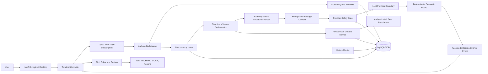

# Grammatical MacWrite
## Product, Platform, Architecture, Execution, and Operations Documentation

**Document status:** Current implementation reference  
**Product:** Grammatical MacWrite  
**Platform:** React 19, Tailwind CSS, TypeScript, Express, tRPC, Prisma ORM, PostgreSQL, local email/password accounts, and a server-side LLM provider boundary
**Current release:** P0 production-hardening release, checkpoint `5c16d3b6`  
**Audience:** Product stakeholders, AI engineers, application engineers, security reviewers, operators, and future contributors

---

## 1. Executive overview

Grammatical MacWrite is a semantic-preserving writing transformation workspace presented as a macOS-inspired terminal. It allows a user to paste or type ordinary prose, long documents, technical Markdown, GitHub-style pull-request descriptions, or selected code comments; choose a transformation mode; and receive an editable, reviewable, exportable result without losing the original source.

The product is intentionally not designed as a blind “rewrite this text” box. Its central promise is that **the model proposes and Grammatical decides**. A provider may suggest a transformation, but the application applies typed context analysis, protected-term rules, structure checks, Unicode preservation, semantic guards, and explicit user review before treating the result as an accepted document.

Grammatical combines three experiences that are usually separate. It has the immediacy and keyboard-oriented ergonomics of a developer terminal, the visual familiarity of a desktop application, and the review and export controls of a serious writing tool. The macOS metaphor is not merely decorative: the Dock represents the four transformation modes, the Terminal is the main execution surface, local commands provide fast interaction, and the desktop frame keeps the user in one persistent workspace instead of opening a sequence of temporary pages.

The current system is ready for a guarded pilot with authenticated users and controlled traffic. It includes server-side quotas, concurrency leases, provider deadlines, retry limits, a provider circuit breaker, daily provider-token reservations, durable privacy-safe telemetry, and an incident runbook. It is not represented as an unrestricted enterprise platform yet; durable browser-independent job recovery, broader abuse evaluation, extensive performance optimization, and formal multi-environment recovery drills remain future scale work.

---

## 2. Why Grammatical exists

Writing tools commonly optimize for surface fluency while leaving the user responsible for detecting meaning drift. That creates a particular problem in technical, professional, and multilingual writing. A rewrite can silently alter a number, weaken a negation, rename a person, change a role, corrupt an identifier, damage a URL, flatten Markdown structure, remove an emoji that carries meaning, or transform executable code that was only included as context.

Grammatical was created to address that trust gap. Its goal is not simply to make sentences sound better. Its goal is to make useful transformations **inspectable, recoverable, structurally safe, and user-controlled**.

The original product vision combined a native-feeling terminal with four writing modes, rich output editing, large-paste handling, clipboard workflows, downloadable files, and a semantic transformation layer. The implementation expanded that vision into a document-aware writing system with persistent history, protected-term glossaries, semantic analysis, tracked changes, Markdown preview, code-comment-only mode, structured exports, and production controls.

The product therefore exists for users who want writing assistance without surrendering authorship. The user should be able to see what was supplied, what was proposed, what was accepted, what was rejected, what remained protected, and what can be exported at the end.

> **Product thesis:** A transformation is trustworthy when the source remains recoverable, the proposed result is validated, the structure is preserved, the user controls final acceptance, and the operational system can fail safely.

---

## 3. What we aimed to build

The intended product was a full writing workstation inside a coherent desktop metaphor rather than a collection of disconnected forms. The user would open the terminal, select one of four modes from the Dock, enter text, press Enter, watch the transformation progress, and edit or export the resulting output without leaving the session.

The design also aimed to solve the difficult cases that ordinary text editors avoid. Very large pastes should be split at meaningful boundaries rather than arbitrary character offsets. Technical documents should preserve Markdown, code fences, commands, URLs, tables, and metadata. Unicode, emoji, combining marks, special punctuation, tabs, and meaningful whitespace should remain intact. A user should be able to accept or reject individual changes, protect terminology, inspect semantic context, and generate a report of the final decision.

The system was also expected to remain useful when something went wrong. Provider failure should not erase the source. A cancelled request should not corrupt the queue. A rejected candidate should remain visible with an explanation. A browser refresh should not create the illusion that a transformation succeeded when it did not. Operational controls should prevent a traffic burst or provider outage from becoming an uncontrolled spending event.

---

## 4. What Grammatical has become

Grammatical has become an **evidence-preserving AI writing platform** with a terminal-native interaction model. It is simultaneously:

| Product identity | What it means in practice |
|---|---|
| Writing transformer | Four modes apply different levels and styles of editing while preserving facts, identity, intent, and structure. |
| Document review workspace | The user can inspect source and proposal, accept or reject changes, reopen a review, and finalize a document before report export. |
| Technical-content editor | Markdown, GitHub-style PR content, tables, links, code fences, commands, identifiers, and card-like structure receive explicit preservation treatment. |
| Large-paste processor | Long input is divided into ordered, boundary-aware blocks and transformed sequentially with per-block status and downloads. |
| Semantic safety layer | Typed entity context, protected evidence, deterministic checks, and semantic-risk explanations are applied around the provider candidate. |
| Desktop-style terminal | The Dock, menu bar, draggable terminal, local commands, keyboard shortcuts, and persistent transcript create a continuous work surface. |
| Controlled AI service | Authentication, quotas, concurrency leases, provider deadlines, retry budgets, circuit breaking, spend reservations, and durable operational telemetry protect the service. |

The result is not a replacement for a human editor and not a claim that model output is automatically correct. It is a system for making model-assisted editing more useful while keeping the user in control.

---

## 5. Who Grammatical serves

### 5.1 Professional writers and editors

Proofread and Improve modes help correct mechanics, clarity, flow, and professional tone while keeping the author’s intended meaning visible. The editable output can be formatted, copied, exported, reviewed, and restored through history.

### 5.2 Engineers and technical teams

Engineers can paste API documentation, release notes, GitHub pull-request descriptions, issue explanations, and technical Markdown. Grammatical transforms eligible human-readable prose while preserving code, commands, identifiers, links, table framing, and structural syntax. Code-comment-only mode offers an explicit opt-in when the user wants natural-language comments improved without touching executable code.

### 5.3 Product, operations, and support teams

Improve, Natural, and Rewrite modes can help convert rough internal notes into clearer explanations, user-facing updates, incident summaries, and operational communication. Protected terms and writing profiles help keep product names, technical vocabulary, and organizational language consistent.

### 5.4 Multilingual and Unicode-heavy workflows

The system is designed to preserve Unicode text, emoji, mixed scripts, special symbols, ASCII sequences, punctuation, tabs, line breaks, and meaningful whitespace. The preservation model is particularly important when the source contains expressive markers or text from multiple writing systems.

### 5.5 Users working with long documents

Large pastes are represented as ordered wrappers with block number, character count, line count, preview, and state. Each block produces a deterministic output filename, while Download all provides a combined fallback. The current browser queue is reliable for an active session; durable server-side recovery remains a future P1 enhancement.

---

## 6. Core user experience

### 6.1 The desktop

The interface opens as a stylized desktop with an original wallpaper, a top menu bar, status indicators, and a Dock. The Terminal window is draggable, minimizable, maximizable, closable, and reopenable. The desktop frame preserves the sense of a single active workspace instead of making every action feel like navigation to a new page.

### 6.2 The Dock and modes

The Dock exposes four modes:

| Mode | Primary purpose | Editing character |
|---|---|---|
| **Proofread** | Correct grammar, spelling, punctuation, capitalization, and agreement. | Minimal edits and maximum source proximity. |
| **Improve** | Improve clarity, flow, concision, and professional polish. | Moderate intervention while preserving facts and intent. |
| **Natural** | Make text fluent, conversational, and idiomatic. | More natural phrasing with semantic restraint. |
| **Rewrite** | Reorganize and rephrase for stronger structure and readability. | Highest structural intervention while preserving identity, facts, and relationships. |

Each mode also supports Low, Standard, and High intensity. Intensity is a constrained typed choice, persisted locally per mode, and resolved into server-side instructions rather than accepting arbitrary client prompt fragments.

### 6.3 Terminal interaction

The prompt uses the active-mode form `[MODE] >`. The user can paste or type text and press Enter, use the send control, or use keyboard shortcuts. Local commands include `clear`, `mode <name>`, `copy-output`, and `help`. These commands are handled locally and do not call the transformation provider.

During processing, the terminal displays the active mode and preserves the input in the transcript. The stream reports acceptance, analysis, transformation, validation, deltas, completion, rejection, cancellation, or a typed failure. The user remains in the same terminal session throughout.

### 6.4 Output editing and export

Completed output is presented in a rich editor with bold, italic, underline, font family, font size, text color, highlight color, undo/redo, selection copy, and copy-all behavior. Exports include plain text, Markdown, HTML, DOCX, per-block text files, combined output, semantic analysis JSON/Markdown, and finalized change reports.

The report export is gated by review finalization. If the user edits the document after finalization, the review becomes stale and the report controls are disabled until the document is reviewed again.

---

## 7. Functional capability inventory

| Capability area | Current provision |
|---|---|
| Transformation modes | Proofread, Improve, Natural, Rewrite. |
| Intensity | Low, Standard, High per mode with local persistence. |
| Large input | Boundary-aware paragraph, line, and sentence chunking; sequential block queue; source-preserving retries. |
| Unicode | Grapheme-safe boundary handling and preservation checks for emoji, mixed scripts, punctuation, symbols, tabs, and whitespace. |
| Context | Passage-level entity typing, roles, evidence, relations, and bounded confidence. |
| Semantic protection | Numbers, dates, URLs, code, terminology, negation, modality, quantifiers, emoji/special characters, whitespace, entity context, and structure. |
| Technical structure | Markdown, GitHub PR framing, headings, lists, block quotes, tables, links, inline code, fenced code, commands, identifiers, card-like content, and optional code comments. |
| Review | Side-by-side source/proposal review, independent accept/reject decisions, finalization timestamp, reopen behavior, and risk explanations. |
| Glossary | Protected-term import/export and deterministic auto-detection suggestions for names, URLs, identifiers, technical terms, entities, and recurring phrases. |
| Persistence | Authenticated transformation history with session grouping, search, restore, update, and deletion. |
| Monitoring | Authenticated benchmark dashboard with durable 24-hour fleet aggregation and privacy-safe metrics. |
| Safety controls | Authentication, quotas, leases, provider deadline, retry budget, circuit breaker, daily token reservation, and source retention. |

---

## 8. Architectural model

### 8.1 High-level architecture

### 8.2 Frontend layer

The frontend is a React 19 application organized around the Home terminal controller and reusable components. The Home page owns desktop state, terminal state, active mode, draft input, active request identity, paste blocks, review state, history interactions, exports, dashboard controls, and keyboard shortcuts. Components such as the rich output editor, semantic analysis panel, tracked-changes review, Markdown preview, glossary settings, and benchmark dashboard keep specialized concerns separate from the terminal shell.

Frontend calls use the typed tRPC client. The browser does not receive provider credentials. It opens the server’s stream URL for an active request, parses typed events, updates the transcript incrementally, and closes the source when the request completes, errors, or is cancelled.

### 8.3 Server layer

The Express server exposes the tRPC API and local email/password account endpoints. Passwords are stored as scrypt hashes and authenticated sessions use signed HTTP-only cookies. The transformation router validates a bounded `TransformInput`, requires authentication, performs durable admission, and delegates the request to the transform stream.

The provider-facing implementation builds mode-specific instructions from typed mode, intensity, writing profile, protected terms, structured-document context, and inferred passage context. The provider boundary is server-side only.

### 8.4 Shared contract layer

Shared TypeScript contracts define transformation modes, intensities, request identity, document context, result shape, semantic checks, stream events, typed failure codes, monitoring samples, review decisions, semantic risks, and Markdown preview state. This prevents server and client behavior from drifting into incompatible ad hoc payloads.

### 8.5 Persistence layer

Prisma ORM maps the application to PostgreSQL. Current persistence includes authenticated users, transformation history, quota windows, concurrency leases, the global control lock, provider circuit state, provider spend windows, and privacy-safe metric events.

The database stores operational control state and user-selected history artifacts separately. Metrics never store raw transformation content. History is account-scoped and user-controlled.

---

## 9. Transformation execution lifecycle

### Step 1: User submission

The user enters text and selects a mode. The client creates a unique request ID and captures the active mode, intensity, protected terms, code-comment setting, document context, and client revision. The source is appended to the terminal transcript before provider work begins.

### Step 2: Client-side document preparation

The client detects whether the input is a large paste or structured document. Long text is divided at meaningful boundaries, with exact order and source reconstruction preserved. A block receives a stable ID, index, character count, line count, preview, and status.

### Step 3: Authentication and admission

The server verifies the user’s signed account session. It then acquires a database-backed control lock, cleans expired leases, checks the fleet concurrency ceiling, increments the user’s minute and day usage windows, and creates a lease. If admission fails, the provider is not called. The route returns a typed failure and `Retry-After` where appropriate.

### Step 4: Semantic context inference

The system derives conservative passage-level context. It can classify entities such as humans, AI systems, organizations, objects, and data streams; identify roles and evidence; and record relations and bounded confidence. The context is evidence for safer transformation, not permission to invent facts.

### Step 5: Structure-aware parsing

Structured input is decomposed into typed segments. Human-readable prose is eligible for transformation. Outer Markdown syntax, code, commands, identifiers, URLs, tables, card framing, metadata, and other protected regions are retained exactly. Code-comment-only mode is opt-in and exposes only comment bodies as editable units.

### Step 6: Provider safety gate

Before an upstream call, the system checks the provider circuit and reserves a conservative completion-token allowance in the daily spend window. If the circuit is open or the reservation budget is exhausted, the provider call is skipped.

### Step 7: Provider invocation

The server constructs the provider messages and invokes the LLM with a 45-second abortable deadline. Retryable failures receive at most three total attempts with bounded equal-jitter exponential backoff. Each attempt is charged against the conservative reservation policy before execution.

### Step 8: Candidate validation

The candidate is checked for emptiness, truncation, protected semantic values, Unicode damage, whitespace changes, entity-context drift, structure damage, and other semantic risks. A rejected candidate never becomes final output. The original source remains available as the fallback.

### Step 9: Streaming and completion

Accepted candidates are split into safe display chunks and emitted as ordered deltas. The complete event carries the final text, model, intensity, semantic context, semantic risks, validation status, checks, and elapsed time. The lease is released in a `finally` path regardless of success, error, or cancellation.

### Step 10: Review, edit, and export

The user edits the accepted result, reviews tracked changes, accepts or rejects individual proposals, finalizes the document, and exports the requested artifact. If edits make a finalized review stale, the system requires reopening and finalizing again before exporting a change report.

---

## 10. Semantic-safety model

Grammatical treats model output as untrusted. Prompt instructions alone are insufficient because a provider can omit, rephrase, or misinterpret protected content. Deterministic validation therefore compares source and candidate after the provider returns.

| Safety dimension | What is protected |
|---|---|
| Numbers and dates | Numeric values, dates, quantities, and their meaningful relationships. |
| URLs and identifiers | Links, technical identifiers, commands, code-like tokens, and opaque references. |
| Terminology | User-protected glossary terms and detected names or technical phrases. |
| Negation and modality | Meaning carried by “not,” uncertainty, obligation, possibility, and related forms. |
| Quantifiers | Meaning carried by all, none, some, only, and equivalent quantity markers. |
| Unicode and symbols | Emoji, special punctuation, mixed scripts, symbols, and meaningful ASCII sequences. |
| Whitespace | Intentional tabs, repeated spaces, paragraph boundaries, and meaningful line structure. |
| Entity context | Person, organization, object, AI-system, data-stream, roles, and relations. |
| Structure | Markdown syntax, code fences, table framing, link destinations, card framing, and metadata. |

A semantic risk is explanatory evidence, not hidden reasoning. It tells the user what was preserved, what requires review, or why a candidate was rejected. The application does not export rejected candidates as accepted analysis.

---

## 11. Data and privacy model

The system separates user artifacts from operational telemetry.

| Data | Current handling |
|---|---|
| Source and output | Held in the active session; persisted to authenticated history only through the history workflow. |
| Review decisions | Stored in the client review model and included in user-requested change reports. |
| Protected terms and profiles | Managed through local settings and portable glossary files. |
| Provider prompts | Constructed server-side for the request; not written to operational metrics. |
| Metrics | Time, durations, queue wait, mode, intensity, outcome, provider-failure flag, and sanitized failure code. |
| Quotas and leases | Account identity, time windows, request IDs, counts, and expiry timestamps. |
| Provider health | Aggregate consecutive failures, open-until time, reserved token totals, and request count. |

The current runbook prohibits placing source text, output text, prompts, protected terms, user identifiers, or provider payloads in logs, metrics, alerts, or incident notes.

---

## 12. Reliability and production controls

The P0 release turns the transformation path from an open provider proxy into a controlled service boundary.

Authentication ensures that transformation capacity is associated with an account. Minute and daily quotas limit abuse and establish a basis for future plan-specific policies. Fleet concurrency leases protect the provider and database from bursts even when the application runs on multiple instances. Lease expiry provides recovery from process failure.

The provider deadline prevents a slow upstream from holding work indefinitely. The retry budget prevents retry amplification. Equal-jitter backoff reduces synchronized retry bursts. The circuit breaker stops repeated upstream failure from consuming all capacity, while the spend reservation budget protects against unexpected provider cost.

Durable telemetry makes health visible beyond one process. The benchmark dashboard shows fleet-wide recent outcomes and latency where durable events are available, while retaining a clearly labeled instance-local fallback when the database is unavailable.

The operational runbook defines proposed guarded-pilot SLOs, error-budget behavior, severity levels, incident triggers, rollback expectations, and data-handling rules. The 99.5% availability target and related objectives are targets to validate through load testing, not historical performance claims.[1]

---

## 13. Current implementation map

| Concern | Representative implementation area |
|---|---|
| Main terminal and desktop | `client/src/pages/Home.tsx` and terminal UI components. |
| Shared transformation transport | `shared/transformations.ts`. |
| Semantic context | `shared/semanticContext.ts`. |
| Document review | `shared/documentReview.ts` and tracked-change components. |
| Structured Markdown | `shared/structuredDocument.ts` and Markdown preview components. |
| Transformation route | `server/routers/transform.ts`. |
| Admission and leases | `server/transformAdmission.ts`. |
| Stream lifecycle | `server/transformStream.ts`. |
| Provider prompts and document transformation | `server/textTransform.ts`. |
| Provider safety | `server/providerSafety.ts`. |
| Shared LLM transport | `server/_core/llm.ts`. |
| Durable metrics | `server/transformMetrics.ts`, `server/routers/metrics.ts`, and `drizzle/schema.ts`. |
| History | `server/routers/history.ts` and `server/db.ts`. |
| Operational policy | `server/RUNBOOK.md`. |
| Database migration | `drizzle/0002_lying_king_cobra.sql`. |

---

## 14. Verification status

The current production-hardening release was verified with 83 Vitest tests, strict TypeScript validation, a production build, and a protected-session browser UI review. The tests cover semantic context, structured documents, Unicode, large-paste behavior, stream events, provider-safety policy, metrics aggregation, history, exports, review decisions, and other existing product behavior.

The build remains subject to a known client bundle-size warning of approximately 1.21 MB minified and 338 KB gzip. Code splitting and performance budgets are intentionally deferred P1 work rather than being described as complete.

The current browser paste queue remains client-local. It preserves source and ordering during an active session, but a browser refresh can abandon unfinished work. Durable server-side job recovery is intentionally deferred P1 work.

The current telemetry dashboard is protected and durable for the 24-hour aggregate, but automated paging integration is not claimed. The runbook currently describes a manual operational review model until an alert-delivery integration is explicitly configured.

---

## 15. What Grammatical provides to users

From a user’s perspective, Grammatical provides a single place to move from rough text to reviewed, formatted, exportable writing. It provides four distinct transformation intentions instead of one ambiguous “improve” button. It provides local control over intensity, terminology, code-comment behavior, and document profile. It provides a terminal that remains open and recoverable while work is in progress.

It provides structural confidence for technical documents, not merely a nicer-looking result. It provides semantic analysis so users can inspect entities, roles, evidence, relations, and confidence. It provides tracked review so the final document is an explicit user decision rather than an invisible replacement. It provides change reports so a finalized transformation can be audited in a portable form.

It also provides graceful failure. When the service cannot safely complete a transformation, the source remains available, the failure is typed, the queue state is preserved as far as the active browser session allows, and the user receives a retry or recovery path rather than silently losing text.

---

## 16. What Grammatical does not claim

Grammatical does not claim that an LLM is always factually correct, that semantic validation replaces human judgment, or that a high-intensity Rewrite is safe for automatic publication without review. It does not claim unrestricted anonymous access, unlimited document size, guaranteed provider availability, automated paging, enterprise compliance certification, or durable browser-independent job recovery.

These boundaries are deliberate. The product is strongest when it is used as a controlled writing and review workspace: the system accelerates transformation, but the user retains authorship and final authority.

---

## 17. Roadmap boundary

The product’s next scale-oriented opportunities are clear but not required for the current guarded pilot. Durable server-side paste-job recovery would make multi-block work resumable across refreshes and browser disconnects. Expanded prompt-injection and abuse evaluation would strengthen the security case for broader public and enterprise use. Code splitting and performance budgets would improve first-load and lower-end-device behavior. Formal multi-environment promotion and recovery drills would strengthen release governance.

These items should be activated by measured need rather than implemented solely for completeness. The current priority is to operate the P0 release, observe real traffic and telemetry, validate the guarded-pilot SLOs, and use user behavior to determine which P1 investment produces the greatest reliability benefit.

---

## 18. Closing statement

Grammatical began as a vision for a better writing terminal inside a macOS-style desktop. It has become a semantic-preserving document transformation platform with structured technical-content handling, reviewable AI assistance, user-controlled exports, and production safety boundaries.

Its defining quality is not that it can rewrite text. Many systems can do that. Its defining quality is that it treats transformation as a controlled lifecycle: preserve the source, understand the passage, protect structure and meaning, ask the provider for a proposal, validate the proposal, expose the evidence, let the user decide, and operate the service within explicit capacity and failure limits.

That is what Grammatical is about, why it exists, what it has become, what it serves, and the standard it is designed to uphold.

## References

[1]: https://sre.google/workbook/error-budget-policy/ "Google SRE Workbook — Example Error Budget Policy"
