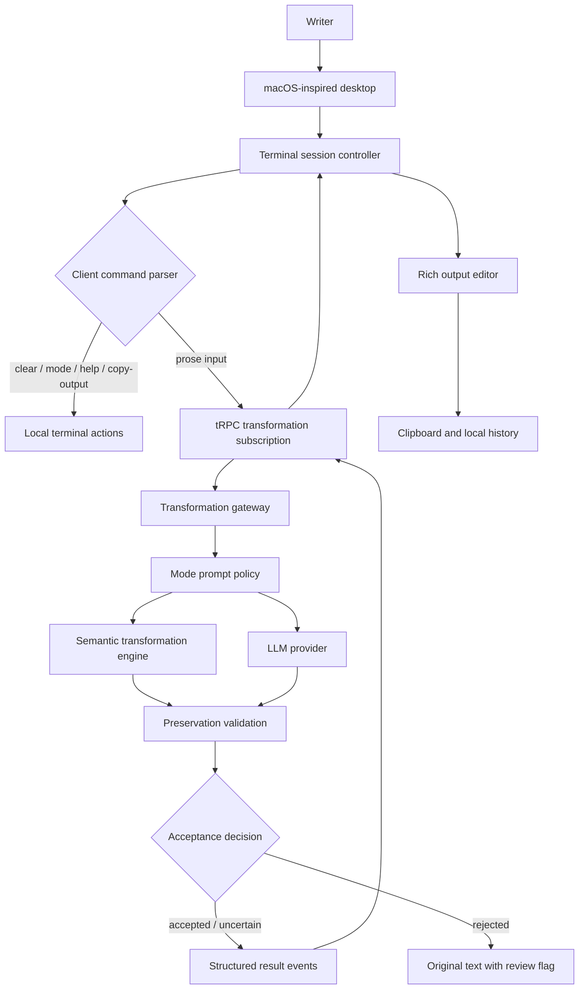

# MacWrite Terminal

## Production Design Specification for a macOS-Inspired Text Transformation Workspace

**Version:** 1.0  
**Author:** Manus AI  
**Status:** Product and technical design only — no application implementation is included in this deliverable.  
**Source inputs:** User requirements, supplied visual references, supplied Grammatical technical reference, and the cited platform documentation.

---

## 1. Product Definition

**MacWrite Terminal** is a browser-based, macOS-inspired desktop environment that makes AI-assisted writing transformation feel immediate, tactile, and trustworthy. The product presents a single, intelligent Terminal window on an atmospheric desktop. A writer pastes or types text, chooses a transformation mode from the Dock, presses Enter, and sees a transparent progress state followed by an editable, richly formatted result in the terminal session itself.

The design must feel like a focused Mac workspace, not a generic dashboard dressed with macOS symbols. The desktop context provides familiarity and expressive character; the terminal remains the principal productivity surface. The interface therefore uses a restrained information hierarchy: a menu bar for global status and utility actions, the terminal for all work, and a purpose-built Dock for the four transformation modes.

> **Design principle:** The product should make transformative AI feel controllable. The user always knows the selected mode, sees when work is in progress, can edit the resulting content directly, and can copy the exact version they have formatted.

The visual language is inspired by macOS conventions, but the experience should be described as **macOS-inspired** rather than a replica or Apple product. It must not imply Apple endorsement or use protected platform artwork beyond appropriately licensed implementation assets.

| Product outcome | What the experience must communicate |
| --- | --- |
| Speed | Entering text has an instant, clear acknowledgement before processing begins. |
| Control | The active mode is visible in the Dock, window chrome, command prompt, and processing line. |
| Trust | The original input remains in the session history and the output is editable, selectable, and copyable. |
| Focus | One high-value task is prioritized over panels, forms, and secondary navigation. |
| Craft | Surfaces, motion, typography, and keyboard behavior feel deliberate and coherent. |

---

## 2. Goals, Non-goals, and Assumptions

### 2.1 Goals

The product must provide four clear text transformation modes: **Proofread**, **Improve**, **Natural**, and **Rewrite**. A user must be able to select a mode by clicking its Dock icon or by issuing a terminal command, submit text with Enter, watch a status message that exactly reads `Transforming text in [MODE] mode…`, then edit and copy the rich output without leaving the terminal.

The implementation design supports a production-quality LLM service through a typed tRPC streaming procedure, but it maintains the supplied Grammatical reference’s central safety principle: transformations should preserve meaning, terminology, numbers, names, negation, and intent. The reference engine uses a semantic representation, validation dimensions, edit planning, and a rejection pathway; this design treats those as **quality and safety requirements**, not as visual decoration.[4]

The workspace must work with mouse, trackpad, keyboard, paste, native selection, and assistive technology. Apple’s macOS guidance supports the overall direction: allow windows to move, resize, hide, and show; use a menu bar for commands; support precision editing; and support keyboard shortcuts and personalization.[1]

### 2.2 Non-goals for Version 1

This experience is not a full Finder clone, a multiprocess operating system emulator, a file manager, a collaboration suite, or a document database. It does not need fake apps, fake notifications, fake user avatars, or fabricated reviews. The desktop exists to provide product character and interaction context, not to simulate every macOS subsystem.

Version 1 also does not promise mathematically guaranteed semantic preservation from an LLM alone. Where the supplied semantic engine is available, it should remain the validation authority. Where it is not available, the service must use conservative prompts, protected-token checks, change auditing, and an explicit fallback policy rather than claiming impossible certainty.

### 2.3 Product Assumptions

| Assumption | Design consequence |
| --- | --- |
| The user may paste short notes or multi-paragraph content. | The terminal input supports multiline paste and preserves line breaks. |
| Users may enter a terminal command instead of prose. | Commands are parsed locally before any API request. |
| The output may need polished presentation before copying. | The result is a rich, editable region with selection-scoped formatting. |
| AI responses may take noticeable time or fail. | Progress, cancellation, retry, and failure states are designed as first-class session events. |
| Clipboard permissions differ by browser and context. | Copy provides rich and plain formats when available, with a visibly explained fallback. |
| The app runs in a browser, not native macOS. | Window interactions are optimized for browser constraints and should not pretend to alter the host system. |

---

## 3. Experience Architecture

### 3.1 Primary User Journey

The default state opens directly into a usable terminal window. The writer selects a mode from the Dock, then types or pastes content at the prompt. The prompt always reflects the active mode with the exact prefix `[MODE] >`, where `MODE` is the uppercase canonical label.

After Enter, the interface must immediately append the submitted text to the scrollback, lock that specific command line, and append a live processing row. During work, the user sees a compact animated spinner followed by the exact message `Transforming text in [MODE] mode…`. The status line must not say “please don’t close the tab”; that wording creates anxiety without giving the user a meaningful control. Instead, the terminal offers an accessible **Cancel** action and communicates that the session remains available.

When the stream completes, the status row resolves into an output panel. The panel contains a small result header, a toolbar, an editable rich output region, a concise result footer, and copy controls. The terminal then advances to a fresh `[MODE] >` prompt. Prior outputs remain in the scrollback and remain independently selectable.

| Stage | User action | Visible system response | Recoverability |
| --- | --- | --- | --- |
| Select | Clicks a Dock mode icon | Dock highlights selected mode; prompt changes immediately. | Click another mode or type `mode <name>`. |
| Submit | Presses Enter with text | Input is committed to history; processing line appears. | Cancel while pending. |
| Stream | Waits for transformation | Spinner persists; output is revealed progressively as chunks arrive. | Retry appears on recoverable error. |
| Edit | Selects text and formats it | Toolbar applies changes only to the selected range, preserving the rest. | Undo/redo within output. |
| Copy | Uses Copy All, shortcut, or command | Clipboard receives the user’s current edited content. | Copy plain text fallback if rich copy is denied. |

### 3.2 Terminal Session Grammar

The terminal should be designed as a simple, readable transcript rather than a fake shell. It has five event types: **system**, **input**, **processing**, **output**, and **error**. Each event has visually distinct but muted styling, so the user can scan a long session without reading every line.

```text
MacWrite Terminal  •  Rewrite

[REWRITE] > The proposal have several unclear parts, and it needs more polish.
◌ Transforming text in REWRITE mode…                         Cancel

┌─ TRANSFORMED OUTPUT ─────────────────────────── 48 words ─────┐
│ The proposal contains several unclear sections and would      │
│ benefit from a more polished, cohesive presentation.          │
└────────────────────────────────────────────────────────────────┘
  B  I  U  Font: SF Pro  Size: 16  Text ●  Highlight ●  Copy all

[REWRITE] >
```

The code-style anatomy is illustrative only. In the product, the output box should look like a native terminal extension: gently elevated from the body, not like a pasted web card.

### 3.3 Exact Modes and Their Promise

The mode names must be consistent across Dock labels, prompt prefix, terminal commands, stream payloads, analytics events, and accessibility labels. The mode semantics follow the supplied technical reference’s progressive transformation policy.[4]

| Mode | Prompt prefix | Dock label | Product promise | Transformation latitude |
| --- | --- | --- | --- | --- |
| Proofread | `[PROOFREAD] >` | Proofread | Correct mechanics while preserving wording and structure whenever possible. | Minimal. |
| Improve | `[IMPROVE] >` | Improve | Improve clarity, flow, and professional polish without adding facts. | Moderate. |
| Natural | `[NATURAL] >` | Natural | Make the writing feel conversational and fluent while preserving intent. | Moderate, tone-aware. |
| Rewrite | `[REWRITE] >` | Rewrite | Reorganize and rephrase substantially for readability while preserving meaning. | Broadest, still guarded. |

---

## 4. Visual Direction and Design System

### 4.1 Art Direction

The environment takes visual cues from the supplied references: a saturated, abstract macOS-style wallpaper; a cool-toned translucent menu bar; a dark graphite terminal with softened corners; bright syntax-inspired accent colors; and a Dock that feels dimensional without becoming cartoonish. The terminal must remain the highest-contrast surface in the composition.

The wallpaper should be an original abstract gradient with deep indigo, electric blue, violet, coral, and restrained amber highlights. It should never contain readable text or brand marks. A vignette and blurred “glass” surfaces prevent the saturated background from competing with the user’s text.

### 4.2 Token System

The palette is intentionally specific so implementation does not drift into generic blue-purple glassmorphism. Values below are design tokens, not a requirement to use any specific CSS framework.

| Token | Value | Intended use |
| --- | --- | --- |
| `desktop-ink` | `#071321` | Wallpaper vignette and maximum-depth backdrop. |
| `desktop-cobalt` | `#174E9C` | Wallpaper blue contour. |
| `desktop-violet` | `#6D3CC3` | Wallpaper depth and dock reflection. |
| `desktop-coral` | `#E54666` | Wallpaper warm contrast, never body text. |
| `glass-light` | `rgba(246, 250, 255, 0.18)` | Menu bar and Dock highlight. |
| `terminal-surface` | `rgba(14, 18, 25, 0.86)` | Main terminal content surface. |
| `terminal-titlebar` | `rgba(48, 53, 65, 0.88)` | Window chrome. |
| `terminal-border` | `rgba(255, 255, 255, 0.14)` | Hairline separation. |
| `terminal-text` | `#F3F7FA` | Primary terminal text. |
| `terminal-muted` | `#95A0B3` | Secondary labels and timestamps. |
| `prompt-accent` | `#74E6A1` | Active prompt label and ready state. |
| `command-accent` | `#74B7FF` | Command keyword and selected UI state. |
| `process-accent` | `#F6C85F` | Spinner and in-progress messaging. |
| `error-accent` | `#FF7F8F` | Recoverable errors. |
| `focus-ring` | `#A5D7FF` | Visible keyboard focus indication. |

The terminal uses **SF Mono** when the system provides it, with `JetBrains Mono` as the web-font fallback and a generic monospace fallback after that. The output editor can use the same mono family by default so formatted text remains at home in the terminal; a user-selected font family applies only to the rich output content, never the command transcript.

| Typography role | Font | Size | Weight / line height |
| --- | --- | --- | --- |
| Menu bar | system sans | 13 px | 500 / 18 px |
| Window title | system sans | 13 px | 600 / 18 px |
| Terminal prompt and transcript | SF Mono / JetBrains Mono | 14–15 px | 400–600 / 1.65 |
| Processing state | SF Mono / JetBrains Mono | 14–15 px | 500 / 1.65 |
| Rich output default | SF Mono / JetBrains Mono | 16 px | 400 / 1.7 |
| Toolbar labels | system sans | 12 px | 600 / 16 px |

### 4.3 Layering and Elevation

The desktop has four depth planes: wallpaper, persistent system chrome, floating Terminal window, and in-window popovers. Shadows are broad and low-opacity. Use a subtle inner highlight on translucent surfaces and a one-pixel border with low contrast. Avoid hard card grids, thick black outlines, or pronounced neon glow.

| Plane | Surface treatment | Shadow / blur |
| --- | --- | --- |
| Wallpaper | Original multi-stop gradient, low-frequency texture | None |
| Menu bar | Light cool glass, 20–28 px backdrop blur | 1 px lower hairline |
| Terminal | Graphite translucency, 22–28 px blur | `0 24px 80px rgba(0, 0, 0, .36)` |
| Dock | Frosted rounded capsule | `0 18px 38px rgba(0, 0, 0, .24)` |
| Menus and color pickers | Near-opaque dark glass | `0 14px 36px rgba(0, 0, 0, .30)` |

### 4.4 Layout Specifications

On a wide viewport, the menu bar is 28 px high. The terminal opens at 78–84% of viewport width, is capped around 1160 px, and initially occupies 62–68% of viewport height. It is horizontally centered and placed slightly above the desktop’s vertical center so the Dock has visual breathing room. The initial terminal body must always show at least one input prompt and enough space for a typical output box.

The Dock sits 18–24 px above the lower viewport edge. It holds exactly four primary mode applications: Proofread, Improve, Natural, and Rewrite. A narrow separator may precede an optional settings icon, but the initial scope should avoid adding unrelated fake apps.

On a narrow screen, the desktop remains atmospheric but the terminal becomes near-fullscreen, with 12 px margins and a fixed safe-area-aware Dock. Dock labels become tooltips or a compact active-mode label rather than permanently visible small text. The rich-text toolbar wraps into two rows or moves into a compact “Format” menu.

---

## 5. Desktop and Window Interaction Design

### 5.1 Menu Bar

The menu bar contains a left-side product name and menu triggers, while the right side contains lightweight status indicators and a live local clock. Status icons are visual affordances only unless their related functionality is implemented. Each is labelled for assistive technology and opens a real small menu when activated; decorative icons must not pretend to change Wi-Fi, battery, or the host machine.

| Area | Elements | Behavior |
| --- | --- | --- |
| Left | Apple-inspired abstract mark, `MacWrite`, `File`, `Edit`, `View`, `Help` | Opens concise menus relevant to the browser app. |
| Right | Privacy indicator, clipboard status, keyboard shortcuts, time | Opens app-level information or commands. |
| Clock | `Wed, 09:41` or locale-aware equivalent | Updates every minute; opens an app time panel only if needed. |

The `File` menu includes New Session, Clear Session, and Export Transcript. The `Edit` menu includes Undo, Redo, Copy Selection, Copy Output, and Select Output. The `View` menu includes Reduce Motion and high-level terminal display preferences. `Help` contains the command guide and keyboard shortcut reference.

### 5.2 Terminal Window

The Terminal’s title bar uses a 14–16 px corner radius at the top. It includes the three traffic-light controls on the left, a centered `Terminal` title, and a small contextual subtitle or active mode marker on the right. The controls should behave predictably:

| Control | Action | User-visible result |
| --- | --- | --- |
| Red close | Close session window | The desktop remains visible with a `Terminal` Dock icon that reopens the same preserved session. Provide a short undo toast. |
| Yellow minimize | Minimize window | Window animates to the Dock; its Dock indicator remains active. |
| Green maximize | Toggle maximized workspace | Terminal fills available desktop area below menu bar; the original size and position are retained for restore. |

The window should be draggable only from the title bar. Dragging must not begin while the user interacts with menus, buttons, or selectable terminal content. On pointer release, the window settles with a 120–180 ms transform transition. It should be clamped to keep the title bar and at least 120 px of body visible within the viewport.

The terminal body scrolls as a single transcript. As new lines arrive, it autoscrolls only if the user is already at or near the end; if the user has scrolled up, do not yank them down. Instead, show a compact “Jump to latest” chip near the bottom edge.

### 5.3 Dock Mode Applications

Each mode icon should be an original, abstract glyph inside a distinct rounded-square app tile. Do not use copied macOS application artwork. The icon system should communicate function at a glance:

| Mode | Icon concept | Accent | Short Dock description |
| --- | --- | --- | --- |
| Proofread | Checkmark over a document baseline | Mint | “Correct mechanics with minimal changes.” |
| Improve | Ascending line with spark | Blue | “Clarify and polish your writing.” |
| Natural | Flowing speech curve | Coral | “Make the tone feel more conversational.” |
| Rewrite | Looping arrows around text lines | Violet | “Restructure and rephrase for readability.” |

Hover magnification should be local and contained: the hovered icon scales to approximately 1.18×, adjacent icons to 1.06×, and all changes settle within 140–180 ms. Hover should not change the active mode; click, keyboard activation, or `mode <name>` changes mode instantly. The active mode gets a small white indicator dot below its icon and a subtle color halo in the Dock, not a large persistent label.

### 5.4 Motion Rules

Motion must reinforce causality. Keyboard actions are immediate. Window open, minimize, Dock hover, menus, and output arrival may animate, but should remain under 300 ms and honor `prefers-reduced-motion`.

| Interaction | Motion | Duration | Reduced-motion behavior |
| --- | --- | --- | --- |
| Dock hover | Scale and small vertical lift | 160 ms | Color/opacity change only |
| Mode switch | Accent pulse at selected icon and prompt update | 140 ms | Instant state change |
| Terminal open | Fade plus translate up 12 px | 220 ms | Fade only |
| Minimize | Scale toward Dock target | 220 ms | Fade out; Dock indicator changes |
| Processing spinner | Stroke rotation | 900 ms linear, continuous | Static indicator plus text |
| Output reveal | Per-chunk opacity or caret continuation | 80–120 ms | Immediate content append |
| Context menu | Opacity + scale from trigger | 160 ms | Opacity only |

---

## 6. Terminal Input and Command System

### 6.1 Prompt Behavior

The prompt line is the terminal’s primary field. Its inactive portion is not a form label; the active mode prefix itself functions as contextual labelling. The input must have an explicit accessible name such as “Terminal input for Improve mode.”

Input supports typing, paste, and deliberate line breaks. The preferred interaction is **Enter to submit** and **Shift+Enter to add a line break**. A pasted multi-paragraph selection should retain newlines, remain editable before submission, and submit only on the next explicit Enter. On touch devices, the visible Send key performs the same submission.

The input line must retain focus after command completion, after transformation completion, after copy output, and after `clear`, unless the user deliberately moves focus to the output toolbar.

### 6.2 Client-side Commands

Commands are recognized only when the entire trimmed input matches a command grammar. They are handled entirely in the client and must never call the transformation backend. An input such as “Please clear the meeting notes” is prose, not a command.

| Literal command | Parse rule | Terminal response | Backend call |
| --- | --- | --- | --- |
| `clear` | Case-insensitive exact match | Clears visible transcript after confirmation if unsaved edits exist; prints fresh welcome line. | Never |
| `mode <name>` | `name` matches one canonical mode, case-insensitive | Changes active mode, updates Dock and prompt, confirms selected mode. | Never |
| `copy-output` | Case-insensitive exact match | Copies latest valid rich output; falls back to plain text if necessary. | Never |
| `help` | Case-insensitive exact match | Prints command reference and keyboard shortcuts. | Never |

`mode` without a valid mode does not guess. It returns a concise terminal error: `Unknown mode. Choose proofread, improve, natural, or rewrite.` A command takes precedence over prose only when it is exact. Leading and trailing whitespace should be ignored.

### 6.3 Command and Keyboard Shortcuts

| Shortcut | Action | Conditions |
| --- | --- | --- |
| `Enter` | Submit prompt | Prompt focused; no IME composition in progress. |
| `Shift+Enter` | Insert line break | Prompt focused. |
| `⌘/Ctrl + Enter` | Transform current prompt | Alternative for users who prefer explicit submit. |
| `⌘/Ctrl + K` | Focus terminal prompt | Does not overwrite draft input. |
| `⌘/Ctrl + C` | Copy user selection | Preserves native selection semantics. |
| `⌘/Ctrl + Shift + C` | Copy latest output | Same outcome as `copy-output`. |
| `⌘/Ctrl + Shift + L` | Clear session | Requires confirmation when current output has unsaved local edits. |
| `Escape` | Cancel active transformation or close current popover | Cancels only the active operation. |
| `⌘/Ctrl + Z` / `⌘/Ctrl + Shift + Z` | Undo / redo in output editor | Output editor focused. |

---

## 7. Rich Output Editor and Formatting Model

### 7.1 Output Box Anatomy

Each successful transformation creates a self-contained output unit within the terminal. The output unit is framed by a low-contrast border and subtly different dark surface. It should not be visually mistaken for terminal input, but it must still look native to the terminal.

| Element | Function | Interaction detail |
| --- | --- | --- |
| Result label | Identifies transformed content | Includes mode and successful status without unnecessary timestamps. |
| Rich text toolbar | Exposes editing controls | Applies command to current selection or updates typing state if collapsed. |
| Editable result | Holds rich transformed content | Uses a content-editable document model; preserves selection while toolbar buttons are pressed. |
| Selection utility | Shows word/character count for selection | Optional and shown only while a selection exists. |
| Copy action | Copies the current post-edit content | Provides Copy All and copy-format menu. |
| Footer | Communicates source mode, elapsed time, and model/engine badge if appropriate | Avoids exposing sensitive prompts or raw provider details. |

### 7.2 Toolbar Design

The toolbar is compact, grouped, and keyboard reachable. Formatting actions apply to the selected range. When no range is selected, the action sets the active typing style for the next entered characters. All action buttons have native-style pressed states, a tooltip, and an accessible label.

| Group | Controls | Expected semantics |
| --- | --- | --- |
| Emphasis | **Bold**, *Italic*, Underline | Uses semantic `strong`, `em`, and underline spans where possible. |
| Type | Font family, font size | Font family choices are limited and readable; size is discrete, not arbitrary pixels. |
| Color | Text color, highlight color | Uses an accessible fixed palette plus custom picker; highlights maintain adequate contrast. |
| Clipboard | Copy selection, Copy all | Copy all includes current modifications, not original streamed content. |
| Safety | Undo, redo, clear formatting | Undo stack is local to the output editor. |

The font-size control includes `12`, `14`, `16`, `18`, `20`, `24`, and `28` px. The initial size is `16` px. Font families are `Terminal Mono`, `System Sans`, `Serif`, and `Reading Sans`; the names in the visual UI can be shortened, but accessibility labels use the full description.

The color system begins with a carefully selected palette rather than an overwhelming rainbow. The palette includes graphite, slate, white, blue, teal, green, yellow, orange, coral, magenta, and violet. Text-color swatches are pre-screened against the output surface; any custom color that fails the product’s contrast threshold should display a warning rather than block deliberate use.

### 7.3 Editor Data Model

The editor needs two representations: a rich internal document and a plain-text projection. The rich document is canonical for rendering and rich clipboard export. The plain projection is canonical for terminal transcript search, command output, fallback clipboard export, and accessibility summaries.

```ts
type RichOutput = {
  id: string;
  sourceInputId: string;
  mode: "proofread" | "improve" | "natural" | "rewrite";
  status: "complete" | "partial" | "cancelled" | "error";
  document: RichTextDocument;
  plainText: string;
  revision: number;
  createdAt: string;
  transformMeta: {
    elapsedMs: number;
    validatorState: "accepted" | "uncertain" | "rejected" | "not_available";
  };
};
```

The preferred implementation uses a purpose-built rich-text engine with a serializable document model and transaction-level selection preservation. Native `contenteditable` can provide the initial surface, but production formatting should not depend solely on deprecated document commands or HTML string mutation. The model must sanitize all imported and model-produced content before rendering.

### 7.4 Clipboard Design

Copy is a core promise, not a cosmetic icon. Users have three copy pathways:

1. **Native selection copy:** The user drags to select any transcript or rich output content and invokes the standard browser or system copy command. This should preserve native expectations.
2. **Copy All button:** The button copies the entire latest output after any local formatting changes.
3. **`copy-output` command:** The command copies the last valid output, including its current edits, and writes a confirmation line in the terminal.

When browser permissions and support allow, the product writes both `text/plain` and sanitized `text/html` so a rich target can retain bold, italics, underline, colors, highlights, fonts, and sizes. The W3C Clipboard API specification explicitly identifies rich content editing as a use case where copied structure may need preservation, while the asynchronous API remains permission-controlled.[3] If rich writing fails, the product writes plain text; if that fails, it selects the output and offers a visible instruction to use the native copy shortcut. The copy confirmation names the format used: `Copied formatted output`, `Copied plain text`, or `Select the output and press ⌘C / Ctrl+C`.

Do not silently overwrite the clipboard at the end of every transformation. Automatic clipboard writes are surprising and conflict with user control.

---

## 8. Transformation and Streaming Architecture

### 8.1 Architectural Position

The supplied Grammatical reference describes a layered system: web frontend, interface layer, transformation core, and supporting semantic validation components.[4] MacWrite Terminal should preserve that separation, even if its first shipped implementation uses a single web application plus a transformation service. The UI never directly calls an LLM provider and never receives provider credentials.



The diagram deliberately allows a semantic engine and an LLM to work together. The semantic engine’s validators may pre-protect entities and terminology, validate LLM or rule-based proposals, and reject outputs that cross critical guardrails. The LLM is useful for nuanced rewrite quality; it must not become an unchecked source of facts.

### 8.2 Server Contract

The server provides a tRPC subscription rather than a conventional fire-and-forget mutation. A subscription is appropriate because the browser needs incremental events during a single transformation. tRPC documents subscriptions as real-time streams and recommends SSE when a simpler, stateless setup is preferable to operating a WebSocket server.[2] Its `httpSubscriptionLink` is specifically an SSE transport and is designed to be selected with a client `splitLink` alongside normal request links.[2]

```ts
type TransformInput = {
  requestId: string;
  text: string;
  mode: "proofread" | "improve" | "natural" | "rewrite";
  protectedTerms?: string[];
  clientRevision: number;
};

type TransformEvent =
  | { type: "accepted"; requestId: string; mode: TransformInput["mode"] }
  | { type: "progress"; requestId: string; phase: "analyzing" | "transforming" | "validating" }
  | { type: "delta"; requestId: string; text: string; sequence: number }
  | { type: "complete"; requestId: string; result: TransformResult }
  | { type: "rejected"; requestId: string; reason: string; fallbackText: string }
  | { type: "error"; requestId: string; code: TransformErrorCode; retryable: boolean };
```

The client treats `accepted` as the moment to show the exact processing line. It appends `delta` events only to the active result draft, ordered by `sequence`. `complete` seals the result and enables full editing. If an output is rejected by semantic validation, the system returns the original source text or a conservative result, clearly marked `Review recommended`; it must never silently present an unsafe rewrite as complete.

### 8.3 Streaming Strategy and Honesty

The ideal path streams tokens or coherent text spans from the upstream model through the server to the browser. The server should buffer enough characters to avoid a distracting one-character “typewriter” effect, emitting at natural boundaries such as words, sentences, or every 25–60 ms.

If the chosen LLM provider cannot provide true token streaming, the server may send **progress events during analysis and validation**, then reveal a completed result in display chunks. This remains a streamed UI response but must not be represented in logs, metrics, or documentation as provider-token streaming. The distinction matters for latency measurement and user trust.

Each subscription must honour cancellation. On `Escape`, the client disposes the subscription, the server aborts the upstream request when supported, and the terminal emits `Transformation cancelled. Your original input remains above.` The original input is never removed.

### 8.4 LLM Prompt Policy

Every mode uses a short, explicit system policy. Prompts must make preservation instructions concrete rather than relying on a vague phrase such as “improve this text.” The transformation request should include the source text separately, never interpolate it into policy instructions.

| Mode | System-policy emphasis | Output rule |
| --- | --- | --- |
| Proofread | Fix grammar, spelling, punctuation, capitalization; preserve wording and structure. | Return unchanged text if no correction is needed. |
| Improve | Improve clarity and flow; keep claims, names, quantities, and certainty unchanged. | Do not add advice, headings, or explanation. |
| Natural | Improve conversational flow; preserve professional requirements and factual statements. | Use contractions only when source tone permits. |
| Rewrite | Reorganize and rephrase; preserve intent, names, numbers, terms, negation, modality, and time references. | Return transformed text only. |

The prompt must prohibit the model from adding prefaces such as “Here is your improved text,” from returning Markdown fences, and from inventing content. Output is treated as untrusted data and is sanitized before it enters the rich-text document.

### 8.5 Semantic Safety Gate

The reference system’s meaningful contribution is the idea that a polished text transformation must be subject to preservation checks. It identifies critical dimensions including entities, claims, numbers, terminology, negation, modality, quantifiers, temporal references, coreference, and certainty.[4] MacWrite Terminal should use the following staged gate:

| Gate | Purpose | Failure policy |
| --- | --- | --- |
| Input normalization | Normalize Unicode, whitespace, and paragraph boundaries while retaining original source. | Preserve original raw source separately. |
| Protected-term extraction | Detect or accept user-provided names, versions, numeric values, URLs, code spans, and domain terminology. | Lock tokens or require exact preservation. |
| Candidate generation | Generate deterministic edits and/or LLM candidate text by mode. | Cap length, cost, and latency. |
| Structural comparison | Compare numbers, dates, URLs, code, protected terms, negation, modality, and salient named entities. | Reject or flag critical drift. |
| Semantic validation | Compare claims and intent with the reference validator where available. | Accept, uncertain, or reject. |
| Output sanitation | Convert valid text to safe rich document nodes. | Strip unsafe markup and scripts. |

The validation status is stored with the result and exposed in a quiet footer. The interface should not overwhelm writers with scores, but it should give them an honest review signal. `Accepted` is neutral; `Review recommended` is amber; `Preserved original` is red only when a substantial request could not pass safeguards.

### 8.6 Error Taxonomy

| Code | Meaning | Terminal copy | User action |
| --- | --- | --- | --- |
| `INPUT_TOO_LONG` | Request exceeds current safe request limit. | `That input is too long for one transformation. Split it into smaller sections.` | Edit and retry. |
| `RATE_LIMITED` | Temporary provider or gateway capacity limit. | `The transformation service is busy. Try again in a moment.` | Retry after countdown. |
| `NETWORK_LOST` | Browser stream disconnected. | `Connection interrupted. Your input is preserved.` | Retry transformation. |
| `CANCELLED` | User ended processing. | `Transformation cancelled. Your input is preserved above.` | Re-submit or change mode. |
| `VALIDATION_REJECTED` | Candidate failed preservation guardrails. | `The result was held because meaning may have shifted.` | Copy original, retry conservative mode, or review. |
| `SERVICE_UNAVAILABLE` | Non-retryable service failure. | `Transformation is temporarily unavailable.` | Retry later; keep session. |

---

## 9. State, Data, and Privacy Design

### 9.1 Client State Model

The desktop state is intentionally compact. The session controller owns mode selection, window geometry, transcript events, active subscription, focused output, undo stacks, and local preference settings. It does not own provider keys, raw model system prompts, or durable user data without explicit user consent.

```ts
type DesktopSession = {
  terminalWindow: {
    isOpen: boolean;
    isMinimized: boolean;
    isMaximized: boolean;
    position: { x: number; y: number };
    size: { width: number; height: number };
  };
  activeMode: "proofread" | "improve" | "natural" | "rewrite";
  transcript: TerminalEvent[];
  activeRequestId: string | null;
  latestValidOutputId: string | null;
  preferences: {
    reduceMotion: boolean;
    outputFont: "mono" | "sans" | "serif" | "reading";
  };
};
```

An optional local recovery store may retain the last session transcript and unsent draft for a short period, but only after a clear privacy decision. A first release should default to **session-only retention**: closing the browser tab removes content unless the user explicitly exports the transcript or enables local recovery.

### 9.2 Privacy and Security Requirements

Text submitted for transformation can contain sensitive content. The product must disclose that submitted text is processed by the configured transformation service. It must never place provider API keys in browser code, write raw input/output to analytics, or log full transformation text by default.

| Risk | Required control |
| --- | --- |
| Provider key exposure | Server-only credentials; no browser-side secret. |
| Prompt injection in source text | Source is untrusted data, separately scoped from system policy; no tool access for transform model. |
| Cross-site scripting in output | Sanitize model output and editor import/export HTML through an allowlist. |
| Clipboard privacy | Copy only on explicit user action or explicit command; never auto-copy. |
| Sensitive telemetry | Capture event type, latency, error code, and text-length bucket; never raw content by default. |
| Session persistence | Default to ephemeral session; explain any local recovery setting. |
| Abuse and runaway cost | Enforce character, request-rate, concurrent-stream, and timeout limits. |

### 9.3 Accessibility Requirements

The desktop metaphor must not obscure web accessibility. Interactive elements use semantic buttons, menu roles, focus management, visible focus rings, and meaningful labels. Do not require drag interactions for core functionality: every window, Dock, toolbar, menu, copy, and mode action has a keyboard pathway.

The rich editor must announce formatting state without reading every style property after each keystroke. A live region announces major state transitions: mode changed, transformation started, output ready, copy result, cancellation, and errors. It must not announce every streamed delta because that becomes unusably noisy for screen-reader users.

| Need | Requirement |
| --- | --- |
| Keyboard use | Full mode selection, prompt interaction, toolbar formatting, copy, menus, and window controls without pointer use. |
| Screen readers | Concise live updates; logical transcript order; output labelled with its mode and completion state. |
| Reduced motion | Disable non-essential Dock and window motion; retain clear state changes. |
| Contrast | Core text and controls meet WCAG AA contrast targets against their actual rendered surfaces. |
| Zoom / reflow | Terminal remains usable at 200% zoom; controls do not overlap or become inaccessible. |
| Touch | Dock icons and traffic lights meet adequate target sizing; drag has a non-drag fallback. |

---

## 10. Quality, Observability, and Testing Plan

### 10.1 Acceptance Criteria

The product is ready for a production beta only when the following behavior is demonstrably true.

| Area | Acceptance criterion |
| --- | --- |
| Mode selection | Clicking any of the four Dock icons changes the active mode and prompt prefix immediately. |
| Prompt format | The prefix always reads exactly `[PROOFREAD] >`, `[IMPROVE] >`, `[NATURAL] >`, or `[REWRITE] >`. |
| Progress copy | An active request visibly displays exactly `Transforming text in [MODE] mode…` with an animated status affordance. |
| Commands | `clear`, `mode <name>`, `copy-output`, and `help` execute locally and make no transform request. |
| Streaming | The terminal can append ordered output events, handle cancellation, and recover visibly from stream failure. |
| Output editing | Bold, Italic, Underline, font family, font size, text color, and highlight color apply to selected output text. |
| Clipboard | Copy All and `copy-output` copy the currently edited result; rich and plain fallback behavior is visible. |
| Session history | Previous inputs and outputs remain scrollable and selectable after later transformations. |
| Accessibility | Critical flows are keyboard operable and announce major state changes. |
| Safety | Protected values are checked; rejected transformations never silently replace source text. |

### 10.2 Test Pyramid

The reference documentation reports extensive rule, property, fuzz, adversarial, and golden-file testing.[4] The product should preserve that discipline with a layered test strategy rather than depending only on visual screenshots.

| Test layer | Examples | Purpose |
| --- | --- | --- |
| Unit | Command parser, exact prompt formatting, mode mapping, clipboard serializers, validator token comparison. | Prevent regressions in deterministic behavior. |
| Contract | tRPC input/output schema, event ordering, cancellation payload, error codes. | Ensure client and server agree. |
| Transformation | Golden examples per mode, protected-term cases, numbers/dates/negation preservation. | Validate text quality and safety. |
| Component | Dock mode selection, terminal window controls, toolbar selection application, live-region copy. | Validate isolated UI behavior. |
| End-to-end | Paste → mode → Enter → progress → result → style → copy; command paths; retry and cancel. | Validate the real user journey. |
| Accessibility | Keyboard-only scripts, focus order, reduced-motion rendering, screen-reader labeling audit. | Ensure inclusive interaction. |
| Visual regression | Terminal surfaces, Dock hover, menu layout, narrow viewport, 200% zoom. | Preserve crafted visual character. |

### 10.3 Telemetry and Operational Signals

Instrument metadata, not content. A transformation event records request duration, text-length bucket, mode, validator state, provider error category, and completion/cancellation status. The copy event records only invocation method (`selection`, `toolbar`, or `command`) and resulting format (`rich`, `plain`, or `fallback`).

The primary quality metrics are mode adoption, successful completion rate, median time to first feedback, median time to usable result, cancellation rate, transformation retry rate, validation rejection rate, and copy success rate. Do not infer writing quality from private text content.

---

## 11. Delivery Sequence and Future Extensions

### 11.1 Recommended Delivery Sequence

| Milestone | Scope | Exit signal |
| --- | --- | --- |
| Foundation | Desktop frame, terminal transcript, Dock selection, command parser, static output editor. | Interaction model can be usability tested without AI. |
| Transformation | Typed request contract, server policy, progress events, result display, retry/cancel. | All four modes return controlled results. |
| Editing and clipboard | Rich document model, toolbar, native selection, copy formats, undo/redo. | Edited output copies faithfully. |
| Safety | Protected-term extraction, validation service integration, rejection surface, retention controls. | Unsafe candidates are detected and explained. |
| Production hardening | Accessibility, observability, performance, rate limits, visual tests. | Beta readiness criteria pass. |

### 11.2 Deliberately Deferred Extensions

Future work can add a diff view, user-defined terminology sets, tone profiles, document import/export, version history, a small command palette, and an optional persistent library. These should be added only after the core terminal loop is fast, legible, trustworthy, and accessible. The Dock should not become a dumping ground for secondary features.

---

## 12. Design Decisions Summary

| Decision | Rationale |
| --- | --- |
| Use a macOS-inspired desktop, not a full operating-system clone. | Delivers emotional familiarity without wasting scope on non-writing simulation. |
| Use four Dock icons as modes. | Makes mode selection tactile, always visible, and consistent with the reference’s four transformation tiers. |
| Keep a scrollable terminal transcript. | Preserves provenance and enables natural input/output review. |
| Use rich output inside the terminal. | Lets writers format the exact transformed result without breaking the interaction context. |
| Handle commands client-side. | Makes `clear`, `mode <name>`, `copy-output`, and `help` immediate, private, and reliable. |
| Use tRPC SSE subscriptions for incremental events. | Fits one-directional server-to-client result updates without operating a dedicated socket server.[2] |
| Pair LLM output with semantic validation. | Preserves the supplied reference’s meaning-preservation intent and avoids treating fluency as correctness.[4] |
| Copy current edited content rather than raw model result. | Honors user agency and matches the promise of the rich editor. |
| Default to session-only text retention. | Treats writing content as sensitive and minimizes unintended persistence. |

---

## References

[1]: https://developer.apple.com/design/human-interface-guidelines/designing-for-macos "Apple Human Interface Guidelines — Designing for macOS"

[2]: https://trpc.io/docs/client/links/httpSubscriptionLink "tRPC — HTTP Subscription Link"  
https://trpc.io/docs/server/subscriptions "tRPC — Subscriptions"

[3]: https://www.w3.org/TR/clipboard-apis/ "W3C — Clipboard API and Events"

[4]: file:///home/ubuntu/upload/Grammatical_Technical_Reference.docx "Supplied Grammatical Technical Reference Documentation — Semantic-First Text Transformation Engine"
