# Grammatical MacWrite

> A semantic-preserving AI writing workspace with a macOS-inspired terminal, four transformation modes, structure-aware editing, explicit review decisions, and production-grade safety controls.

Grammatical MacWrite helps users transform prose without treating language transformation as a blind replacement operation. The model proposes a candidate; Grammatical validates it against semantic, structural, Unicode, and document-level rules; the user reviews and finalizes the result.

The application is designed for professional writing, technical documentation, GitHub pull-request descriptions, long pasted documents, code-comment editing, multilingual text, and any workflow where preserving meaning matters as much as improving fluency.

## Repository description

**Recommended GitHub description:**

> Semantic-preserving AI writing workspace in a macOS-inspired terminal. Proofread, improve, naturalize, or rewrite text with Unicode-safe chunking, Markdown/code preservation, tracked review, rich exports, protected glossaries, and production-grade provider safety.

## Project status

Grammatical is currently suitable for a controlled, authenticated pilot. The current production-hardening release includes access controls, durable quotas, fleet concurrency leases, provider deadlines, bounded retries, provider circuit breaking, token-spend reservations, privacy-safe durable telemetry, and an operational runbook.

It is not presented as an unrestricted anonymous service or as an enterprise SLA product. Durable browser-independent paste-job recovery, extensive public prompt-injection evaluation, performance code splitting, and formal multi-environment disaster-recovery drills remain scale-oriented follow-up work.

## Why Grammatical exists

Most AI writing tools optimize for fluent output but leave users responsible for detecting meaning drift. That is risky when text includes a person’s identity, a technical identifier, a number, a date, a URL, a negation, a code block, a Markdown table, an emoji, or a sentence whose meaning depends on a previous passage.

Grammatical addresses this trust gap by treating transformation as a controlled lifecycle:

1. Preserve the original source.
2. Understand the passage and its structure.
3. Protect facts, identity, terminology, Unicode, and technical regions.
4. Ask the language model for a bounded proposal.
5. Validate the candidate deterministically.
6. Stream only safe results.
7. Let the user review, accept, reject, edit, finalize, and export.

> **Core principle:** The model proposes; Grammatical decides; the user remains the final authority.

## Core capabilities

### Four transformation modes

| Mode | Purpose |
|---|---|
| **Proofread** | Correct grammar, spelling, punctuation, capitalization, and agreement with minimal intervention. |
| **Improve** | Improve clarity, flow, concision, and professional polish while preserving meaning. |
| **Natural** | Make text more fluent, idiomatic, and natural without inventing facts. |
| **Rewrite** | Reorganize and rephrase text for stronger structure while preserving identity, facts, and intent. |

Each mode supports **Low**, **Standard**, and **High** intensity. Intensity is typed, bounded, and persisted locally per mode.

### macOS-inspired terminal workspace

The interface provides a desktop-style experience with a menu bar, Dock, draggable terminal window, minimize/maximize controls, local commands, keyboard shortcuts, persistent transcript state, and visual progress while a transformation is running.

The Dock represents the four modes as mode applications. The terminal prompt displays the active mode and accepts text, pasted documents, and local commands without sending local commands to the provider.

### Large-paste processing

Large input is split into ordered blocks at meaningful paragraph, line, and sentence boundaries rather than arbitrary character offsets. Each block exposes its index, character count, line count, preview, processing state, and output filename.

The current active-session queue supports sequential processing, per-block retries, cancellation, source preservation, individual `output1.txt`, `output2.txt`, and later downloads, and a combined Download all artifact. Browser-independent server-side queue recovery after refresh is planned follow-up work.

### Semantic context and preservation

Grammatical infers conservative passage-level context, including entities such as humans, AI systems, organizations, objects, and data streams, together with roles, evidence, relations, and bounded confidence. This context grounds transformation; it does not authorize the system to invent facts.

The semantic guard checks applicable dimensions including:

- Numbers, dates, quantities, and percentages.
- Names, identities, organizations, products, and roles.
- URLs, commands, package names, identifiers, and code-like tokens.
- Negation, modality, certainty, and quantifiers.
- Protected terminology and user-selected glossary terms.
- Emoji, grapheme clusters, combining marks, mixed scripts, and symbols.
- Meaningful tabs, repeated spaces, line endings, and paragraph boundaries.
- Markdown, GitHub PR structure, links, tables, code fences, and metadata.

Unsafe, empty, truncated, malformed, or structurally damaged candidates are rejected, and the original source remains available for retry or review.

### Technical Markdown and code handling

Grammatical understands structure-aware Markdown and GitHub-style content. It transforms eligible prose while preserving outer structure and protected regions such as:

- Headings, lists, task checkboxes, and block quotes.
- Tables and divider rows.
- Inline code and fenced code blocks.
- Commands, URLs, identifiers, package names, and metadata.
- Pull-request sections and card-like pasted content.
- Executable code by default.

An optional **code-comment-only** mode exposes comment bodies as transformation units while leaving executable code, identifiers, fences, and comment markers intact.

### Review, glossary, and exports

Users can inspect source and proposal side by side, accept or reject individual changes, reopen a finalized review, and finalize the document before exporting a change report. If the document changes after finalization, export is gated until the review is performed again.

Protected-term glossaries support import and export. Auto-detection suggests potential names, entities, URLs, identifiers, technical phrases, and recurring terminology; suggestions remain user-controlled.

Available exports include:

- Plain text.
- Markdown.
- HTML.
- DOCX.
- Per-block text files.
- Combined multi-block output.
- Semantic analysis JSON and Markdown.
- Provenance-rich change-report JSON and Markdown.

### Persistent history

Authenticated users can group transformations into sessions, search history, restore prior work, update entries, and delete history through user-controlled actions.

### Production safety and operations

The current hardening release includes:

| Control | Current behavior |
|---|---|
| Authentication | Transformation and fleet metrics access require an email/password account session. |
| Short-window quota | 20 transformations per user per minute. |
| Daily quota | 200 transformations per user per day. |
| Fleet concurrency | Six active database-backed transformation leases. |
| Lease recovery | Expired leases are recoverable after a 120-second backstop. |
| Provider deadline | 45-second abort-aware deadline per attempt. |
| Retry budget | Three maximum attempts with bounded equal-jitter backoff. |
| Provider circuit | Opens after five consecutive failures with a 60-second cooldown. |
| Provider budget | 480,000 reserved completion tokens per day using a 2,400-token per-attempt reservation. |
| Telemetry | Durable 24-hour fleet aggregate containing metadata only, not user text. |
| Operations | SLOs, error-budget policy, incident thresholds, rollback guidance, and data boundaries. |

See [`server/RUNBOOK.md`](server/RUNBOOK.md) for the detailed operating policy.

## How to use Grammatical

### 1. Open the workspace

Open the deployed application or run the local development server. Create an account with an email and password, or sign in to an existing account, before submitting a transformation.

### 2. Choose a mode

Select Proofread, Improve, Natural, or Rewrite from the Dock. Open the intensity settings to choose Low, Standard, or High for the active mode.

### 3. Prepare optional document settings

Before transforming a technical document, you can configure a writing profile, protected terms, code-comment-only behavior, and Markdown preview. The protected-term auto-detection control can suggest terms from the current document.

### 4. Enter or paste text

Type a short passage or paste a larger document into the terminal. Large documents are grouped into readable blocks. Markdown, code, URLs, commands, and PR-style structure are analyzed without being blindly flattened.

### 5. Submit the transformation

Press Enter or use the terminal send control. The terminal shows progress while typed stream events arrive. The source remains in the transcript while the result is being generated.

### 6. Review the result

Edit the rich output with formatting controls, inspect semantic analysis, compare source and proposal, and accept or reject individual tracked changes. If the candidate is unsafe, Grammatical keeps the source and reports the failure rather than silently replacing it.

### 7. Finalize and export

Finalize the reviewed document before exporting a change report. Use the output editor, copy controls, local `copy-output` command, or one of the text, Markdown, HTML, DOCX, semantic-analysis, and change-report exports.

## Local commands and shortcuts

### Terminal commands

| Command | Action |
|---|---|
| `help` | Show the local command guide. |
| `clear` | Clear the visible terminal transcript. |
| `mode proofread` | Switch to Proofread mode. The same pattern works for `improve`, `natural`, and `rewrite`. |
| `copy-output` | Copy the latest valid output to the clipboard. |

### Keyboard shortcuts

| Shortcut | Action |
|---|---|
| `Ctrl/Cmd + Alt + I` | Open transformation intensity settings. |
| `Ctrl/Cmd + Alt + B` | Open the benchmark dashboard. |
| `Ctrl/Cmd + Shift + C` | Copy the latest output. |
| `Ctrl/Cmd + K` | Focus the terminal prompt. |

## Architecture

```mermaid
flowchart LR
  U[User] --> UI[React macOS-style desktop]
  UI --> RPC[Typed tRPC SSE stream]
  RPC --> AUTH[Email and password session]
  AUTH --> ADMIT[Quota and concurrency admission]
  ADMIT --> STREAM[Transform stream orchestrator]
  STREAM --> PARSE[Structure-aware parser]
  PARSE --> CONTEXT[Passage semantic context]
  CONTEXT --> PROVIDER[Provider safety gate]
  PROVIDER --> LLM[Server-side LLM boundary]
  LLM --> GUARD[Deterministic semantic guard]
  GUARD --> REVIEW[Rich editor and review]
  REVIEW --> EXPORT[Text, MD, HTML, DOCX, reports]
  ADMIT --> DB[(PostgreSQL)]
  PROVIDER --> DB
  STREAM --> METRICS[Privacy-safe durable telemetry]
  METRICS --> DB
```



### Frontend

The React frontend centers on the terminal controller and reusable components for the rich editor, semantic analysis, document review, Markdown preview, glossary settings, history, and benchmark dashboard. The browser receives typed stream events and never receives provider credentials.

### Server

Express hosts the tRPC API and email/password account endpoints. Passwords are stored as scrypt hashes, and sessions use signed HTTP-only cookies. The transformation router validates input and performs authenticated admission. Provider prompts and calls remain server-side.

### Shared contracts

TypeScript contracts are shared between client and server for modes, intensities, requests, results, stream events, semantic checks, review decisions, document structures, and monitoring samples. This keeps the client protocol aligned with the server implementation.

### Persistence

Prisma ORM maps the system to PostgreSQL. Persistence covers users, authenticated history, quota windows, concurrency leases, provider circuit state, provider spend windows, and privacy-safe transformation metric events.

## Execution lifecycle

1. The user submits a request with a unique request ID and typed mode settings.
2. The client preserves the source and divides large documents into ordered blocks when necessary.
3. The server verifies authentication and checks quotas, leases, and request limits.
4. Passage-level semantic context is inferred conservatively.
5. Structured input is parsed into eligible prose units and protected regions.
6. The provider circuit and daily reservation budget are checked before upstream work.
7. The provider is called with a 45-second abortable deadline and bounded retries.
8. The candidate is checked for semantic, Unicode, whitespace, entity, and structure drift.
9. Accepted output is streamed as typed events; rejected output falls back to the source.
10. The user edits, reviews, finalizes, and exports the result.
11. The active lease is released and privacy-safe telemetry is persisted regardless of outcome.

## Repository structure

```text
client/
  src/pages/Home.tsx              Main desktop and terminal controller
  src/components/                Editor, review, dashboard, glossary, and UI components
  src/lib/                       Client utilities and tRPC binding
server/
  routers/                       Typed API routers
  transformAdmission.ts          Authentication, quota, lease, and admission controls
  transformStream.ts             Streaming lifecycle and resource handling
  textTransform.ts               Prompt construction and provider transformation
  providerSafety.ts              Deadline, retry, circuit, and spend safety
  transformMetrics.ts            In-process and durable telemetry aggregation
  RUNBOOK.md                     SLO and incident operations
shared/
  transformations.ts             Shared transformation and stream contracts
  semanticContext.ts              Passage context types and inference
  structuredDocument.ts           Markdown and technical-document parsing
  documentReview.ts               Review, glossary, and provenance contracts
prisma/
  schema.prisma                  PostgreSQL schema
  migrations/                    Generated migrations
server/*.test.ts                 Unit and integration tests
AI_ENGINEERING_VALIDATION.md     Production AI validation plan
GRAMMATICAL_PLATFORM_DOCUMENTATION.md  Full product and architecture documentation
```

## Development setup

### Prerequisites

Install Node.js 22 or a compatible current Node.js runtime, pnpm, and access to the configured PostgreSQL database. Database and session-signing settings are read from environment variables; do not commit secrets or `.env` files.

### LLM providers

Grammatical uses an OpenAI-compatible chat-completions API. The recommended transformation priority is Groq Qwen (`GROQ_MODEL`), OpenRouter Ling (`LLM_SECONDARY_MODEL`), DeepSeek (`DEEPSEEK_MODEL`), then OpenRouter GLM 5.3 Flash (`LLM_QUATERNARY_MODEL`). Small and ordinary requests start with Groq; large requests start with Ling; difficult requests start with GLM. If a provider fails, the server tries the remaining configured tiers in priority order. Ling and GLM can share the OpenRouter endpoint and API key while using separate model IDs. DeepSeek is enabled only when its API key and model are configured. Prompts and submitted text are sent to whichever provider handles the request, so review provider privacy and retention settings before enabling fallbacks.

See `.env.example` for variable names and default API base URLs. Provider keys belong only in the ignored local `.env` or your deployment secret manager.

### Install dependencies

```bash
pnpm install
```

### Start development

```bash
pnpm dev
```

The development server starts the Express, tRPC, and Vite-integrated application. The exact preview URL is provided by the project environment.

### Run the checks

```bash
pnpm test
pnpm check
pnpm build
```

`pnpm test` runs the Vitest suite. `pnpm check` performs strict TypeScript validation. `pnpm build` creates the production client and bundled server output.

### Database changes

Update the Prisma schema first, generate and review a migration, and apply it through the project’s managed database workflow. The local convenience command is:

```bash
pnpm db:push
```

For production, use the managed migration procedure and review migration ordering before applying changes. Never use destructive SQL casually because application data is not automatically recoverable.

### Formatting

```bash
pnpm format
```

## Testing and validation

The current suite includes deterministic semantic, Unicode, structure, context, review, export, stream, queue, provider-safety, telemetry, history, and router coverage. It also includes the AI engineering regression and failure-injection suites.

The latest verified release passes:

- **109 Vitest tests.**
- TypeScript validation with `pnpm check`.
- Production build with `pnpm build`.
- Authenticated protected-session UI verification.

The full validation plan is documented in [`AI_ENGINEERING_VALIDATION.md`](AI_ENGINEERING_VALIDATION.md). It defines semantic invariants, adversarial prompt-injection tests, provider fault injection, quota and circuit tests, load and soak profiles, browser validation, staged-environment requirements, human evaluation, and release gates.

## Production operations

Read [`server/RUNBOOK.md`](server/RUNBOOK.md) before operating the service. The runbook defines the guarded-pilot SLOs, error-budget responses, alert thresholds, provider instability procedures, quota and capacity response, spend-budget handling, telemetry outage response, security/privacy incident boundaries, and rollback checklist.

The benchmark dashboard is authenticated and distinguishes durable fleet telemetry from a current-instance fallback. Telemetry is deliberately metadata-only: it records timing, queue wait, mode, intensity, outcome, provider-failure status, and sanitized failure code without recording source text, output text, prompts, protected terms, user IDs, or provider payloads.

## Security and privacy boundaries

All user text is untrusted content. Embedded instructions in a pasted document are not treated as system authority. Provider prompts are constructed server-side. Operational logs and telemetry must not contain raw user content or secret values.

Users should avoid pasting confidential or regulated material unless the provider, deployment, retention, and organizational policies have been reviewed for that use case. History is authenticated and user-controlled, while operational telemetry is intentionally content-free.

## Known limitations

The active large-paste queue is browser-local. A browser refresh or closure can abandon unfinished blocks, although the current session preserves source and ordering during normal processing. A durable server-side resumable job queue is a planned scale enhancement.

The client bundle remains relatively large, and infrequently used panels and export code are not fully code-split. Performance budgets and broader load evidence should be established before high-volume use.

Automated paging integration is not claimed by the current dashboard. The runbook currently describes a manual operational review model until an alert-delivery integration is configured.

Provider quality remains provider-dependent. Semantic guards reject many unsafe candidates, but users should review important transformations before publication.

## Contribution guidance

Before changing transformation behavior, read [`GRAMMATICAL_PLATFORM_DOCUMENTATION.md`](GRAMMATICAL_PLATFORM_DOCUMENTATION.md), [`AI_ENGINEERING_VALIDATION.md`](AI_ENGINEERING_VALIDATION.md), and [`server/RUNBOOK.md`](server/RUNBOOK.md). Preserve the source-first failure model, typed contracts, structure-aware behavior, and privacy-safe telemetry boundary.

A contribution should include focused tests for changed behavior, preserve Unicode and structure invariants, update documentation when behavior changes, and pass:

```bash
pnpm test
pnpm check
pnpm build
```

Do not add raw prompts, user content, credentials, provider payloads, or fabricated customer testimonials to fixtures, logs, documentation, or tests.

## Suggested GitHub topics

`ai-writing`, `text-transformation`, `semantic-preservation`, `llm-safety`, `typescript`, `react`, `trpc`, `drizzle-orm`, `mysql`, `unicode`, `markdown`, `developer-tools`, `macos-ui`, `document-review`, `llm-observability`

## License

This project is licensed under the MIT License. See the repository license file for the complete terms.
